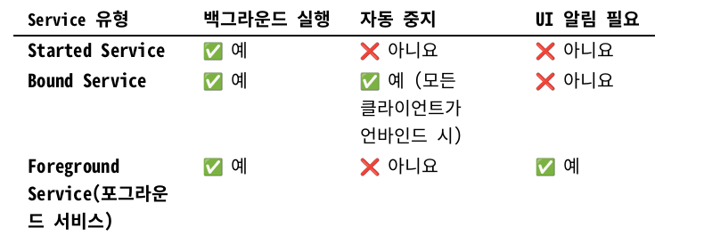
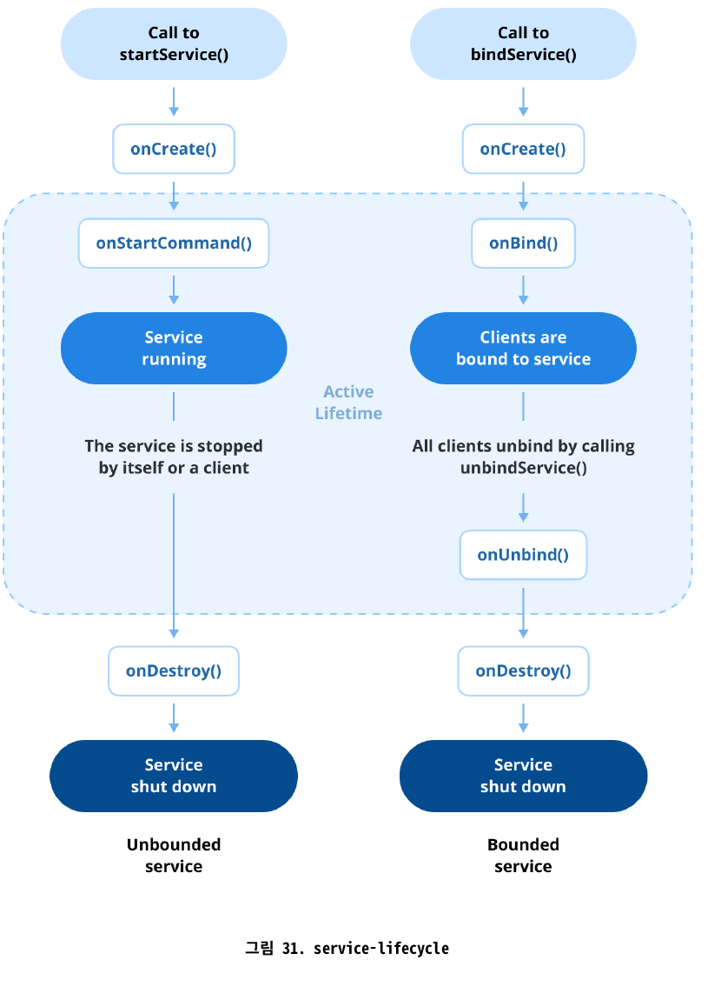

# Q9. Service란 무엇인가요? - 발표 자료

- 원문: `manifest-android-interview-kr.pdf` 52~62쪽 (PDF 60~70쪽)
- 실전 질문: 안드로이드에서 Started 서비스와 Bound 서비스의 차이점은 무엇이며, 각각 언제 사용해야 하나요?
- 표기 규칙: 한 문장에 한 사실. 용어는 `한글(영어 원문)`으로 한 번 정의한 뒤 같은 용어만 사용.
- "원문 밖": 책에 없고 공식 문서로 보충한 내용. 출처는 맨 끝에 정리.

---

## 1. 용어

| 용어 | 뜻 |
|---|---|
| 백그라운드 상태(background state) | 사용자가 앱 화면을 보지 않는 상태 |
| 메인 스레드(main thread) | 화면을 그리고 터치를 처리하는 스레드. UI 스레드(UI thread)라고도 부름 |
| 작업자 스레드(worker thread) | 메인 스레드가 아닌 다른 스레드 |
| 클라이언트(client) | Service에 바인딩한 컴포넌트 (Activity 등) |

- "백그라운드"라는 단어만 쓰면 백그라운드 상태와 작업자 스레드가 섞임.
- 이 자료에서는 둘 중 한 용어로만 씀.

---

## 2. Service의 정체

1. Service는 앱 컴포넌트(app component)임.
2. Service에는 사용자 인터페이스(user interface)가 없음.
3. Service는 앱이 백그라운드 상태일 때도 실행될 수 있음.
4. 사용 예: 음악 재생, 파일 다운로드, 데이터 동기화.

| 항목 | Activity | Service |
|---|---|---|
| 사용자 인터페이스 | 있음 | 없음 |
| 주 역할 | 사용자와 상호작용하는 진입점(entry point), 화면 하나 | 화면 없이 작업 실행 |
| 백그라운드 상태일 때 | 화면이 가려져 상호작용하지 않음 (`onStop()`) | 계속 실행될 수 있음 |

---

## 3. 함정: Service는 메인 스레드에서 실행됨 (원문 밖)

1. Service는 메인 스레드에서 실행됨.
2. Service는 작업자 스레드를 스스로 만들지 않음.
3. 작업자 스레드가 필요하면 개발자가 직접 만들어야 함. (예: 코루틴 `Dispatchers.IO`)

```kotlin
class MyService : Service() {
    override fun onStartCommand(intent: Intent?, flags: Int, startId: Int): Int {
        Thread.sleep(10_000)   // 메인 스레드를 10초 동안 막음
        return START_STICKY
    }
    override fun onBind(intent: Intent?): IBinder? = null
}
```

- 이 코드가 도는 동안 터치는 처리되지 않고 대기함.
- 입력 이벤트(input event)에 5초 넘게 응답하지 못하면 ANR(Application Not Responding) 발생.

> 핵심 문장: "백그라운드 상태에서 살아 있을 수 있지만, 실행은 메인 스레드에서 한다."

---

## 4. Started Service (원문 52쪽, 62쪽)

1. 다른 컴포넌트가 `startService()`를 호출하면 시작됨.
2. 멈추라는 명령을 받을 때까지 계속 실행됨.
3. 멈추는 방법: Service가 `stopSelf()` 호출, 또는 다른 컴포넌트가 `stopService()` 호출.
4. 자신을 시작한 컴포넌트와 독립적(independent)임.

```
Activity ──startService(intent)──▶ Service
                                    │ onStartCommand() 에서 작업 실행
Activity ──finish()                 │ (Activity가 끝나도 계속 실행)
             작업 완료 ──stopSelf()──▶ onDestroy() ──▶ 종료
```

- 자동으로 멈추지 않음 → 작업이 끝나면 직접 멈춰야 함.
- 멈추지 않으면 리소스 낭비(resource waste): 프로세스가 계속 살아 메모리, 배터리, CPU를 씀.
- 사용 예: 음악 재생, 파일 업로드/다운로드.

---

## 5. Started는 "종류"가 아니라 "시작 방식" (원문 밖)

1. `startService()`로 시작하면 started 상태.
2. `bindService()`로 연결하면 bound 상태.
3. Service 클래스에는 "나는 Started Service"라는 표시가 없음.
4. 한 Service가 started 상태와 bound 상태를 동시에 가질 수 있음.
5. 이때는 `stopSelf()`/`stopService()` 호출 **그리고** 모든 클라이언트의 연결 해제가 있어야 종료됨.

```
            startService() ──▶ started 상태 ─┐
같은 Service                                 ├─ 둘 다 끝나야 onDestroy()
            bindService()  ──▶ bound 상태  ──┘
```

- `onBind()`가 `null` 반환 = "bound 상태를 허용하지 않음"이라는 선언.

---

## 6. Bound Service (원문 52~53쪽, 61~62쪽)

1. 다른 컴포넌트가 `bindService()`를 호출하면 bound 상태가 됨.
2. Service는 `onBind()`에서 `IBinder`를 반환함.
3. 바인딩된 클라이언트가 하나라도 있으면 활성 상태 유지.
4. 모든 클라이언트가 연결을 끊으면(unbind) 자동 종료. (started 상태가 아닐 때)

```
클라이언트(Activity) ◀── IBinder(통로) ──▶ 서버(Service)
```

- 서버(server) = Service, 클라이언트 = 바인딩한 컴포넌트, `IBinder` = 둘 사이의 통로(interface).
- 사용 예: 원격 서버에서 데이터 가져오기, 블루투스 연결 관리.

---

## 7. Bound 코드

Service 쪽 (원문 53쪽 그림 27)

```kotlin
class BoundService : Service() {
    private val binder = LocalBinder()

    inner class LocalBinder : Binder() {
        fun getService(): BoundService = this@BoundService
    }

    override fun onBind(intent: Intent?): IBinder = binder
}
```

클라이언트 쪽 (원문 밖, 공식 문서 기준으로 줄인 예)

```kotlin
private val connection = object : ServiceConnection {
    override fun onServiceConnected(name: ComponentName?, binder: IBinder?) {
        service = (binder as BoundService.LocalBinder).getService()
    }
    override fun onServiceDisconnected(name: ComponentName?) { service = null }
}

override fun onStart() {
    super.onStart()
    bindService(Intent(this, BoundService::class.java), connection, Context.BIND_AUTO_CREATE)
}

override fun onStop() {
    super.onStop()
    unbindService(connection)
}
```

- `LocalBinder` 방식은 같은 프로세스(process) 안에서만 사용 가능.
- 다른 프로세스와 연결: Messenger, AIDL (면접 기준 밖, 이름만).

---

## 8. Started vs Bound: 고르는 두 기준

| 기준 | Started | Bound |
|---|---|---|
| 통신 방향 | 한 방향. Intent를 보내고 끝 | 양방향. `IBinder`로 메서드 직접 호출 |
| 수명을 정하는 주체 | Service 자신 (시작한 컴포넌트와 독립) | 클라이언트 (마지막 클라이언트가 떠나면 종료) |
| 사용 예 | 화면을 닫아도 계속되는 작업 | 화면이 Service에 계속 묻는 작업 |

- 음악 앱은 둘 다 사용 (원문 밖, 공식 문서 예):
  - Activity가 Service를 **시작**해 음악을 재생 → 사용자가 앱을 떠나도 음악이 계속됨.
  - 사용자가 돌아오면 Activity가 Service에 **바인딩**해 재생을 다시 제어함.

---

## 9. Foreground Service (원문 53~58쪽)

1. 지속적인 알림(ongoing notification)을 표시하면서 실행되는 Service.
2. `startForeground()`를 호출해 포그라운드가 되며, 이때 즉시 알림을 표시해야 함.
3. 사용 예: 음악 재생, 내비게이션(navigation), 위치 추적(location tracking), 파일 업로드.

| 기준 | 일반 Service | Foreground Service |
|---|---|---|
| 사용자 인지(user awareness) | 눈에 띄지 않게 실행 | 알림으로 항상 보임 |
| 우선순위(priority) | 메모리가 부족하면 먼저 종료될 수 있음 | 시스템이 종료할 가능성이 적음 |
| 사용 사례 | 가벼운 작업 | 사용자가 계속 알아야 하는 작업 |

---

## 10. Foreground 코드와 버전 규칙

```kotlin
override fun onStartCommand(intent: Intent?, flags: Int, startId: Int): Int {
    val notification = createNotification()
    ServiceCompat.startForeground(
        this, 1, notification,
        ServiceInfo.FOREGROUND_SERVICE_TYPE_DATA_SYNC
    )
    return START_STICKY
}
```

```xml
<uses-permission android:name="android.permission.FOREGROUND_SERVICE" />
<uses-permission android:name="android.permission.FOREGROUND_SERVICE_DATA_SYNC" />

<service
    android:name=".ForegroundService"
    android:foregroundServiceType="dataSync"
    android:exported="false" />
```

| 버전 | 규칙 |
|---|---|
| Android 8.0 (API 26)+ | 알림 채널(notification channel)을 먼저 만들어야 함 |
| Android 14 (API 34)+ | 매니페스트와 런타임 양쪽에 포그라운드 서비스 유형(foreground service type) 지정. 없으면 `MissingForegroundServiceTypeException` |
| 공통 | 유형마다 대응하는 권한(permission) 선언 |

---

## 11. 함정: 원문 표의 "Service 유형" (원문 55쪽)



*출처: 원문 55쪽 표*

- 표는 세 가지를 같은 "유형"처럼 나란히 놓음.
- 실제로는 기준이 다름:
  - Started, Bound → **시작 방식(how it is started)**
  - Foreground → **우선순위와 알림 표시(priority and visibility)**
- 그래서 서로 배타적이지 않음. 보통 started 상태의 Service가 `startForeground()`로 승격됨.

> 핵심 문장: "서로 다른 기준이라서 한 Service가 여러 상태를 동시에 가질 수 있다."

---

## 12. Foreground가 필요해진 이유 (원문 밖)

1. Android 8.0부터 앱이 백그라운드 상태일 때 `startService()`를 호출하면 `IllegalStateException` 발생.
2. 해결 순서:
   1. `startService()` 대신 `startForegroundService()` 호출.
   2. Service는 생성 후 5초 안에 `startForeground()`를 호출하고 알림 표시.
   3. Android 14+ 라면 유형 지정 (음악 재생은 `mediaPlayback`).
3. Android 12부터 백그라운드에서 Foreground Service 시작도 제한됨 (면접 기준: 이름만).

- 시스템의 방향: "사용자 몰래 오래 도는 Service"는 막고, "알림으로 자신을 드러내는 Service"만 허용.

---

## 13. 생명주기 (원문 59쪽 그림 31)



*출처: 원문 59쪽 그림 31*

| 메서드 | 호출 시점 | 할 일 |
|---|---|---|
| `onCreate()` | Service가 처음 생성될 때 | 리소스 초기화 |
| `onStartCommand()` | `startService()`로 시작될 때 | 작업 실행, 재시작 방식 반환 |
| `onBind()` | `bindService()`로 바인딩될 때 | `IBinder` 반환 |
| `onUnbind()` | 마지막 클라이언트가 연결을 끊을 때 | 바인딩 관련 리소스 정리 |
| `onDestroy()` | Service가 종료될 때 | 리소스 해제, 스레드 중지 |

---

## 14. 호출 횟수와 비동기 (원문 밖)

호출하는 쪽에서 보면 비동기(asynchronous)

- `startService()`: 즉시 반환. 그 뒤 시스템이 `onStartCommand()` 호출.
- `bindService()`: 즉시 반환. `IBinder`는 나중에 `ServiceConnection.onServiceConnected()`로 전달.

Service 안에서 보면 순서 보장

| 메서드 | 호출 횟수 |
|---|---|
| `onCreate()` | Service가 이미 실행 중이면 호출 안 됨. `onStartCommand()`/`onBind()`보다 먼저 |
| `onStartCommand()` | `startService()` 호출마다 **매번** |
| `onBind()` | **첫 번째 클라이언트**가 바인딩할 때 한 번. 이후 클라이언트는 캐시된 같은 `IBinder`를 받음 |

- `onStartCommand()`는 "명령" → 들어올 때마다 처리.
- `onBind()`는 "통로" → 한 번 만들어 모두에게 나눠 줌.

---

## 15. onUnbind()와 onRebind()


*출처: Android Developers, Bound services overview*

1. `onUnbind()`의 기본 반환값은 `false`.
2. `true`를 반환하면, 다음 바인딩 때 `onBind()` 대신 `onRebind()`가 호출됨.
3. 이 상황은 Service가 **started 상태이면서 바인딩도 허용할 때** 발생.
   - 모든 클라이언트가 떠나도 started 상태라 Service는 살아 있음.
   - 클라이언트가 돌아오면 `onRebind()` 호출.
4. 즉 `onRebind()` = "살아 있는 Service에 클라이언트가 돌아왔다"는 신호.

- 예상치 못한 종료 뒤가 아님. 종료되었다면 새로 생성되어 `onBind()`가 다시 호출됨.

---

## 16. onStartCommand()의 반환값

시스템이 Service를 강제로 종료한 뒤의 동작.

| 반환값 | 다시 생성하는가 | 다시 받는 Intent |
|---|---|---|
| `START_NOT_STICKY` | 하지 않음 (보낼 Intent가 남아 있을 때만 생성) | - |
| `START_STICKY` | 다시 생성 | `null` |
| `START_REDELIVER_INTENT` (원문 밖) | 다시 생성 | 마지막으로 받은 Intent |

- `START_STICKY`로 재생성되면 `intent`가 `null`.
  - `intent!!` → NPE로 앱 종료.
  - `intent?.getStringExtra("url")` → 종료는 안 되지만 URL을 잃어 작업을 이어갈 수 없음.
- 마지막 Intent가 필요한 작업 → `START_REDELIVER_INTENT`.

---

## 17. Activity 생명주기와의 차이

| 기준 | Activity | Service |
|---|---|---|
| 메서드 | `onCreate` → `onStart` → `onResume` → `onPause` → `onStop` → `onDestroy` | `onCreate` → `onStartCommand` / `onBind` → `onUnbind` → `onDestroy` |
| 상태를 바꾸는 원인 | 화면이 보이는지, 조작할 수 있는지 | 누가 시작했는지, 누가 연결되어 있는지 |

- 같은 이름은 `onCreate()`, `onDestroy()` 둘뿐.
- Service에는 사용자 인터페이스가 없음 → 화면 가시성을 나타내는 `onStart`/`onResume`/`onPause`/`onStop`이 필요 없음.
- Bound 클라이언트가 `onStart()`에서 바인딩, `onStop()`에서 해제 → 화면 기준 생명주기에 호출 기준 생명주기를 맞물림.

---

## 18. WorkManager (원문 55쪽 권고 + 원문 밖)

원문: 즉시 실행이 필요하지 않은 작업에는 Service 대신 Jetpack WorkManager 사용.

1. 앱이 화면에서 사라져도 계속 실행되어야 하는 작업용 Jetpack 라이브러리.
2. 예약된 작업을 내부 SQLite 데이터베이스에 저장.
3. 그래서 앱 재시작, 기기 재부팅 뒤에도 다시 예약됨. → 지속성 작업(persistent work).

| 기준 | Service | WorkManager |
|---|---|---|
| 프로세스가 종료되면 | 작업이 사라짐 (`START_STICKY`는 재시작 **시도**일 뿐) | 저장된 작업이 다시 예약됨 |
| 기기를 재부팅하면 | 작업이 사라짐 | 다시 예약됨 |
| 실행 조건(constraint) | 직접 구현 | 선언 (예: 네트워크 연결됨) |
| 실패 시 재시도(retry) | 직접 구현 | 지수 백오프(exponential backoff) 정책 제공 |
| 스레드 | 직접 생성 | 코루틴, RxJava 연동 제공 |

---

## 19. WorkManager 코드와 작업 종류

```kotlin
class UploadWorker(ctx: Context, params: WorkerParameters) : CoroutineWorker(ctx, params) {
    override suspend fun doWork(): Result =
        try {
            uploadPhotos()
            Result.success()
        } catch (e: IOException) {
            Result.retry()          // 백오프 정책에 따라 나중에 다시 시도
        }
}

val request = OneTimeWorkRequestBuilder<UploadWorker>()
    .setConstraints(
        Constraints.Builder()
            .setRequiredNetworkType(NetworkType.UNMETERED)   // Wi-Fi 같은 무제한 네트워크에서만
            .build()
    )
    .build()

WorkManager.getInstance(context).enqueue(request)
```

| 작업 종류 | 설명 |
|---|---|
| 즉시(immediate) | 바로 시작해 곧 끝나야 함. 우선 실행(expedited) 가능 |
| 장기 실행(long running) | 10분 넘게 걸릴 수 있음 |
| 지연 가능(deferrable) | 나중에 시작하거나 주기적으로 실행 |

- 어울리는 작업: 로그/분석 데이터 전송, 서버와 주기적 데이터 동기화, 이미지 처리 후 업로드.
- 안 맞는 작업: 프로세스가 사라지면 함께 끝나도 되는 작업 (코루틴으로 충분), 즉시 실행이 필요한 모든 작업.

---

## 20. 급하지 않은 작업을 Service로 하면 생기는 위험

1. Service는 프로세스가 살아 있는 동안만 실행됨 → 프로세스 종료, 재부팅 때 작업이 사라짐.
2. 네트워크 조건 확인과 실패 재시도를 모두 직접 구현해야 함.
3. Android 8.0+ 백그라운드 상태에서 `startService()` → `IllegalStateException`.
   → 사용자가 신경 쓰지 않는 작업 때문에 알림을 띄우는 Foreground Service를 써야 함.

> 핵심 문장: "급하지 않은 작업을 Service로 처리하면 작업이 사라지거나 시작 제한에 걸린다. WorkManager는 작업을 저장해 결국 실행되도록 보장한다."

---

## 21. 무엇을 쓸지 고르는 순서

```
화면이 닫히면 끝나도 되는가? ── 예 ──▶ 코루틴 (viewModelScope 등)
        │ 아니요
사용자가 지금 보고 듣는 작업인가? ── 예 ──▶ Foreground Service (음악, 내비게이션)
        │ 아니요
늦어도 되지만 반드시 끝나야 하는가? ── 예 ──▶ WorkManager (동기화, 로그 전송, 백업)

※ 화면이 Service와 계속 대화해야 하면 ──▶ Bound Service
```

| 상황 | 선택 |
|---|---|
| 앱을 닫아도 음악이 계속 나와야 함 | Foreground Service |
| 검색 화면 API 호출, 화면을 닫으면 취소돼도 됨 | 코루틴 |
| Wi-Fi일 때 사진 백업, 재부팅해도 끝나야 함 | WorkManager |
| 재생 화면이 현재 재생 위치를 계속 물어봄 | Bound Service |

---

## 22. 헷갈리기 쉬운 점

| 헷갈린 말 | 바른 말 |
|---|---|
| Service = 백그라운드 스레드 | Service는 메인 스레드에서 실행. 작업자 스레드는 직접 생성 |
| 작업자 스레드를 "늘린다" | 처음부터 0개. 직접 **만든다** |
| 멈추지 않으면 메모리 누수 | 리소스 낭비 (프로세스가 살아 메모리, 배터리, CPU 소모) |
| `IBinder`가 서버 | 서버는 Service. `IBinder`는 통로 |
| Started, Bound, Foreground는 세 가지 유형 | 기준이 다름. 한 Service가 여러 상태를 동시에 가짐 |
| `onBind()`는 클라이언트 수만큼 호출 | 첫 클라이언트 때 한 번. `IBinder` 캐시 |
| `onRebind()`는 예상치 못한 종료 뒤 호출 | started이면서 bound인 Service에 클라이언트가 돌아올 때 |
| 앱을 닫아도 계속되는 음악 = Bound | Foreground Service. Bound는 클라이언트가 떠나면 종료 |

---

## 출처

- 원문: 『매니페스트 안드로이드 인터뷰』 52~62쪽 (그림 26~33, 55쪽 표)
- Android Developers, [Services overview](https://developer.android.com/develop/background-work/services)
- Android Developers, [Bound services overview](https://developer.android.com/develop/background-work/services/bound-services)
- Android Developers, [Background execution limits](https://developer.android.com/about/versions/oreo/background)
- Android Developers, [ANRs](https://developer.android.com/topic/performance/vitals/anr)
- Android Developers, [Application fundamentals](https://developer.android.com/guide/components/fundamentals)
- Android Developers, [Service API reference](https://developer.android.com/reference/android/app/Service)
- Android Developers, [WorkManager](https://developer.android.com/topic/libraries/architecture/workmanager)
- Android Developers, [Persistent work](https://developer.android.com/develop/background-work/background-tasks/persistent)
